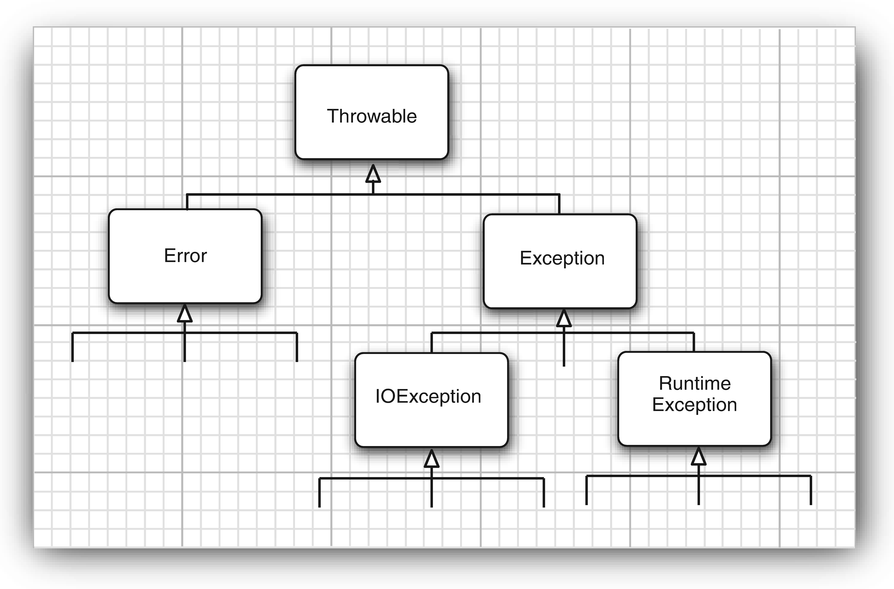

> 大多数内容摘选自Core Java, Thinking in Java。部分来自网络

`heap堆` `stack堆栈` `queue队列` `reference引用`

[TOC]

# 控制流程
1. Java标准程式库中的大多数`classes`都复写了`equals()`，所有它们都会比较对象（而非其`references`）的内容是否相等。
2. 在比`int`更小的基本类型（亦即`char、byte、short`）上进行任何数学运算或位元运算时，运算之前其值会先被晋升为`int`，最后所得结果也会是`int`类型。
3. 在迭代述句的主体内，`break`会跳出循环，不在执行剩余部分。`continue`会停止当次迭代，回到循环起始处，开始下一个迭代过程。
4. `labeld continue`会跳跃至`label`所在处，然后恰在`label`之后重新进入循环。`labeld break`会跳跃`label`所描述的循环。在Java里头使用`labels`，唯一的理由是：在巢状回圈中想要令`break`或`continue`越过一个以上的巢状层级（`nested level`)
5. `Math.random()`会产生介于0和1之间的值`[0，1)`

# 对象与类
## 面向对象程序设计概述

&emsp;&emsp;面向对象的程序是由对象组成的，每个对象包含对用户公开的特定功能部分和隐藏的实现部分。只要对象能够满足要求，就不必关心其功能的具体实现过程。在OOP中，不必关心对象的具体实现，只要能够满足用户的需求即可。

&emsp;&emsp;传统的结构化程序设计通过设计一系列的过程（即算法）来求解问题。一旦确定了这些过程，就要开始考虑存储数据的方式。而OOP却调换了这个次序，将数据放在第一位，然后再考虑操作数据的算法。

> &emsp;&emsp;实现一个简单的Web 浏览器可能需要大约2000个过程，这些过程可能需要对一组全局数据进行操作。采用面向对象的设计风格，可能只需要大约100个类，每个类平均包含20个方法。后者更易于程序员掌握，也容易找到bug。假设给定对象的数据出错了，在访问过这个数据项的20个方法中查找错误要比在2000个过程中查找容易得多。

### 类
&emsp;&emsp;类（`class`）是构造对象的模板或蓝图。

&emsp;&emsp;**封装**（`encapsulation`,有时称为数据隐藏）是与对象有关的一个重要概念。从形式上看，封装不过是将数据和行为组合在一个包中，并对对象的使用者隐藏了数据的实现方式。对象中的数据称为实例域（`instance field`), 操纵数据的过程称为方法（`method`)。对于每个对象都有一组特定的实例域值。这些值的集合就是这个对象的当前状态（`state`)。无论何时，只要向对象发送一个消息，它的状态就有可能发生改变。封装的优点：
1. 可以改变内部实现，除了该类的方法之外，不会影响其他代码。
    ```java
    public String getName() {
        return firstName + " " + lastName;
    }
    ```
2. 更改器方法可以执行错误检查。

> 注意不要编写返回引用可变对象的访问器方法。如果需要，应该首先对它进行克隆(`clone`)。
```java
class Employee {
    private Date hireDay;
    public Date getHireDay() {
        return (Date) hireDay.clone();
    }
}
```

&emsp;&emsp;实现封装的关键在于绝对不能让类中的方法直接地访问其他类的实例域。程序仅通过对象的方法与对象数据进行交互。

**常用的类之间的关系：**

+ 依赖`user-a`
+ 聚合`has-a`
+ 继承`is-a`

&emsp;&emsp;一个类的方法操纵另一个类的对象，我们就说一个类依赖于另一个类。应该尽可能地将相互依赖的类减至最少。如果类A不知道B的存在，它就不会关心B的任何改变（这意味着B的改变不会导致A产生任何bug）。用软件工程的术语来说，就是让类之间的耦合度最小。

&emsp;&emsp;聚合关系意味着类A的对象包含类B的对象。
### 对象
三个主要特性：

+ 行为`behavior`——可以对对象施加哪些操作或方法
+ 状态`state`——当施加那些方法时，对象如何响应
+ 标识`identity`——如何辨别具有相同行为和状态的不同对象

&emsp;&emsp;同一个类的所有对象实例，由于支持相同的行为而具有家族式的相似性。对象的行为是用可调用的方法定义的。

&emsp;&emsp;每个对象都保存着描述当前特征的信息。这就是对象的状态。对象的状态可能会随着时间而发生改变，但这种改变不会是自发的。对象状态的改变必须通过调用方法实现（如果不经过方法调用就可以改变对象状态，只能说明封装性遭到了破坏）。

&emsp;&emsp;对象的状态并不能完全描述一个对象。每个对象都有一个唯一的身份(`identity`)。

## 方法参数

&emsp;&emsp;Java程序设计语言总是采用**按值调用**。也就是说，方法得到的是所有参数值的一个拷贝，特别是，方法不能修改传递给它的任何参数变量的内容。

&emsp;&emsp;**注意**：Java程序设计语言对对象采用的不是引用调用，实际上，对象引用是按值传递的。

```java
public static void swap(Employee x, Employee y) {
    Employee temp = x;
    x = y;
    y = temp;
}
Employee a = new Employhee("Alice");
Employee b = new Employhee("Bob");
swap(a, b);
// 方法并没有改变存储在变量a和b中的对象引用
```

## 对象构造
初始化顺序：

1. 创建对象时，在堆上分配储存空间，将字段初始化（基本类型设置为默认值，引用类型为空）
2. 执行所有出现于字段定义处的初始化动作
3. 执行构造器

静态初始化：

- 静态对象先于“非静态”对象初始化
- 只有在第一个该类对象被创建（或者第一次访问静态数据，常量不算）的时候，才会被初始化
- 静态块与其他静态初始化动作一样

## 包
&emsp;&emsp;`import`语句的唯一的好处是简捷。可以使用简短的名字而不是完整的包名来引用。

&emsp;&emsp;如果使用`import`语句引入整个包中的类`import java.util.*;`，那么可能会增加编译时间，但不会影响程序运行的性能，因为当程序执行时，只能将真正使用的类的字节码文件加载到内存。

&emsp;&emsp;`import`语句不仅可以导入类，还增加了导入静态方法和静态域的功能。

## 类设计技巧

1. 一定要保证数据私有
2. 一定要对数据初始化
3. 不要在类中使用过多的基本类型

    用其他的类代替多个相关的基本类型的使用。这样会使类更易于理解且易于修改。例如，用一个成为`Address`的新类替换一个`Customer`类中以下的实例域：
    ```java
    private String street;
    private String city;
    private String state;
    private int zip;
    ```

4. 不是所有的域都需要独立的域访问器和域更改器

    有一些实例域不应该被修改或访问
5. 将职责过多的类进行分解
6. 类名和方法名要能够体现它们的职责

    类命名的良好习惯是采用一个名词（Order）、前面有形容词修饰的名词（RushOrder）或动名词（有“-ing”后缀）修饰名词（例如，BillingAddress）。
7. 优先使用不可变的类

    更改对象的问题在于，多个线程试图同时更新一个对象，就会发生并发更改。其结果是不可预料的。如果类是不可变的，就可以安全地在多个线程之间共享其对象。

# 继承

&emsp;&emsp;一个对象变量可以指示多种实际类型的现象被称为**多态**（`polymorphism`）。在运行时能够自动地选择调用哪个方法的现象称为动态绑定（`dynamic binding`）。`Metchod-call`（函式呼叫）连结方式：先期连结，后期连结（执行期连结、动态连结）

&emsp;&emsp;如果方法是`static、final、private(自动final)`或者构造器，那么编译器将可以准确地知道应该调用哪个方法， 我们将这种调用方式称为静态绑定(`static binding`)。与此对应的是，调用的方法依赖于隐式参数的实际类型， 并且在运行时实现动态绑定。Java中除了`static`方法和`final`方法，其他方法都是后期连结（后期绑定）

&emsp;&emsp;每次调用方法都要进行搜索，时间开销相当大。因此，虚拟机预先为每个类创建了一个方法表(`method table`), 其中列出了所有方法的签名和实际调用的方法。这样一来，在真正调用方法的时候，虚拟机仅查找这个表就行了。

&emsp;&emsp;`final`类不能被继承，`final`类的方法自动成为`final`，但不包括域。

&emsp;&emsp;`final`方法不能被覆盖（即重写，但是可以重载）。`private`方法自动成为`final`。子类访问不了父类的`private`方法，但是可以定义一个跟它一样的方法，这种写法类似重写，但实际不是，因为访问不了，何来的重写。

&emsp;&emsp;`final`域在构造对象后，就不允许被改写。`final`域都要初始化，不是在定义处，就是在构造器上。

&emsp;&emsp;`final`参数无法在方法中让参数指向别的引用。

复杂对象调用构造器的顺序：
1. 调用父类构造器（base class）
2. 按声明顺序初始化成员
3. 调用到子类构造器（derived class）

## 控制可见性的4个访问修饰符

1. 仅对本类可见——private
2. 对所有类可见——public
3. 对本包和所有子类可见——protected
4. 对本包可见——默认

## 继承的设计技巧

1. 将公共操作和域放在超类
2. 不要使用受保护的域

    `protected`机制并不能够带来更好的保护，其原因主要有两点
    1. 子类集合是无限制的，任何一个人都能够由某个类派生一个子类，并编写代码以直接访问`protected`的实例域，从而破坏了封装性。
    2. 同一个包中的所有类都可以访问`proteced`域，而不管它是否为这个类的子类。
3. 使用继承实现“is-a”关系
4. 除非所有继承的方法都有意义，否则不要使用继承
5. 在覆盖方法时，不要改变预期的行为
6. 使用多态，而非类型信息

    以便使用多态性提供的动态分派机制执行相应的动作

7. 不要过多地使用反射

# 接口、lambda表达式与内部类
## 接口
&emsp;&emsp;接口`interface`用来描述类具有什么功能，而并不给出每个功能的具体实现。接口中的所有方法自动地属于`public`。

> &emsp;&emsp;可以将接口方法标记为`public`，将域标记为`public static final`。有些人处于习惯或提高清晰度的考虑愿意这样做。但Java语言规范却建议不要书写这些多余的关键字。

&emsp;&emsp;在Java SE 8中，允许在接口中增加静态方法。理论上讲，没有任何理由认为这是不合法的。只是这有违于将接口作为抽象规范的初衷。

### 默认方法
&emsp;&emsp;在Java SE 8中，可以为接口方法提供一个默认实现。必须用`default`修饰符标记这样一个方法。有些情况下， 默认方法可能很有用。例如：鼠标点击事件，大多数情况下只需要关心其中的1、2个事件类型。实现这个接口的程序员只需要为他们真正关心的事件覆盖相应的监听器。
```java
public interface MouseListener {
    default void mouseClicked(MouseEvent event) {}
    default void mousePressed(MouseEvent event) {}
    default void mouseReleased(MouseEvent event) {}
    default void mouseEntered(MouseEvent event) {}
    default void mouseExited(MouseEvent event) {}
}
```

> &emsp;&emsp;在JavaAPI中， 你会看到很多接口都有相应的伴随类，这个伴随类中实现了相应接口的部分或所有方法， 如`CoUection/AbstractCollectkm`或`MouseListener/MouseAdapter`。在JavaSE 8中，这个技术已经过时。现在可以直接在接口中实现方法。

&emsp;&emsp;默认方法的一个重要用法是“接口演化”（`interface evolution`)。简单来说就是对以前的接口增加新的方法，不会导致实现接口的类出问题。

### 解决默认方法冲突
&emsp;&emsp;如果先在一个接口中将一个方法定义为默认方法，然后又在超类或另一个接口中定义了同样的方法，规则如下：

1. 超类优先。同名而且有相同参数类型的默认方法会被忽略
2. 接口冲突。如果有两个接口提供同名且参数类型相同的方法，必须覆盖这个方法来解决冲突。

&emsp;&emsp;一个类扩展了一个超类，同时实现了一个接口，并从超类和接口继承了相同的方法。只会考虑超类方法，接口的所有默认方法都会被忽略。这正是“类优先”规则。

&emsp;&emsp;“类优先”规则可以确保与Java SE 7的兼容性。如果为一个接口增加默认方法，这对于有这个默认方法之前能正常工作的代码不会有任何影响。

## lambda表达式
&emsp;&emsp;`lambda`表达式是一个可传递的代码块，可以在以后执行一次或多次。

&emsp;&emsp;Java SE 8之前，在Java中传递一个代码段并不容易，不能直接传递代码段。 Java 是一种面向对象语言，所以必须构造一个对象，这个对象的类需要有一个方法能包含所需的代码。
```java
// 定时器
class Worker implements ActionListener {
    public void actionPerformed(ActionEvent event) { // do some work}
}
Timer t = new Timer(1000, new Worker());
t.start();

// 比较器
class LengthComparator implements Comparator<String> {
    public int compare(String first, String second) {
        return first.length() - second.length();
    }
}
Arrays.sort(strings, new LengthComparator());
```
### lambda表达式的语法
```java
// 参数，箭头以及一个表达式
(String first, String second) -> first.length() - second.length();

// 代码块的方式
(String first, String second) ->
    {
        if (first.length() < second.length()) return -1;
        else if (first.length() > second.length()) return 1;
        else return 0;
    }

// 没有参数，仍然要提供空括号，就像无参数方法一样
() -> { for (int i = 100; i >= 0; i++) System.out.println(i); }

// 如果可以推导出参数类型，则可以忽略其类型
Comparator<String> comp
    = (first, second) // Same as (String first, String second)
        -> first.length() - second.length();

// 如果方法只有一个参数，而且这个参数的类型可以推导得出，那么甚至可以省略小括号
ActionListener listener = event ->
    System.out.println("The time is " + new Date());
    // Instead of (event) -> ... or (ActionEvent event) -> ...

// 无需指定lambda表达式的返回类型。lambda表达式的返回类型总是会由上下文推导得出
```
###  函数式接口
&emsp;&emsp;只有一个抽象方法的接口，称为**函数式接口**（`functional interface`）。需要这种接口的对象时，就可以提供一个`lambda`表达式。

&emsp;&emsp;`Comparator`就是只有一个方法的接口：
```java
Arrays.sort(words, (first, second) -> first.length() - second.length());
```

&emsp;&emsp;在底层，`Arrays.sort`方法会接收实现了`Comparator<String>`的某个类的对象。在这个对象上调用`compare`方法会执行这个`lambda`表达式的体。这些对象和类的管理完全取决于具体实现，与使用传统的内联类相比，这样可能要高效得多。最好把`lambda`表达式看作是一个函数，而不是一个对象，另外要接受`lambda`表达式可以传递到函数式接口。
```java
Timer t = new Timer(1000, event -> {
    // do some work😀
});
```
### 方法引用
```java
// 等价于提供方法参数的lambda表达式
Timer t = new Timer(1000, event -> System.out.println(event));
Timer t = new Timer(1000, System.out::println);
// 第1个参数会成为方法的目标
Arrays.sort(strings, String::compareToIgnoreCase)
Arrays.sort(strings, (x, y) -> x.compareToIgnoreCase(y))
// 使用this或super参数
this:equals
x -> this.equals(x)
```

### 构造器引用
略


## 内部类
1. **成员式内部类：**
    1. 有`static`修饰符则为类级（静态内部类），否则为对象级。类级可以通过外部类直接访问，对象级需要先生成外部的对象后才能访问：`outObjectName.new`
    2. 内部类访问外部类对象：`outClassName.this`
    3. 非静态内部类中不能声明任何static成员
    4. 一般把内部类声明成`private`的，这样除了外部类以外没人能访问。完全隐藏实现的细节。
2. **局部内部类（包括匿名内部类）：**
    1. 定义在方法和作用域中的类，只在代码块中可见。优势是对外界隐藏
    2. 不能用`public、private、protected`修饰，只能使用缺省的
    3. 局部内部类只能访问`final`变量
    4. 匿名类可以创建，接口，抽象类，与普通类的对象。

> 最吸引人的原因，每个内部类都能独立继承一个接口，而无论外部类是否已经继承了某个接口。inner class是多重继承问题的完整解决方案。 

# 异常
## 异常分类
&emsp;&emsp;异常对象都是派生于`Throwable`类的一个实例。



&emsp;&emsp;`Error`类层次结构描述了Java运行时系统的内部错误和资源耗尽错误。应用程序不应该抛出这种类型的对象。如果出现了这样的内部错误，除了通告给用户，并尽力使程序安全地终止之外，再也无能为力了。这种情况很少出现。

&emsp;&emsp;由程序错误导致的异常属于`RuntimeException`。“如果出现`RuntimeException`异常，那么一定是你的问题”是一条相当有道理的规则。应该通过检测数组下标、检测是否为空来避免此类异常的发生。

&emsp;&emsp;而程序本身没有问题，但由于像I/O错误这类问题导致的异常属于其他异常。

派生于`RuntimeException`的异常：
- 错误的类型转换：`ClassCastException`
- 数组访问越界：`ArrayIndexOutOfBoundsException`
- 访问空指针：`NullPointerException`

非`RuntimeException`包括：
- 试图在文件尾部后面读取数据
- 试图打开一个不存在的文件
- 试图根据给定字符串查找`Class`对象，而这个类并不存在

&emsp;&emsp;派生于`Error`类或`RuntimeExcetion`类的所有异常成为**非受查（unchecked）异常**，其他异常称为**受查（checked）异常**。

> &emsp;&emsp;`RuntimeException`这个名字很容易让人混淆。实际上，现在讨论的所有错误都发生在运行时。`RuntimeException`表示程序中的逻辑错误；非`RuntimeException`表示不可预测的异常。

&emsp;&emsp;一个方法必须声明所有可能抛出的受查异常，而非受查异常要么不可控制`Error`，要么就应该避免发生`RuntimeException`。如果方法没有声明所有可能发生的受查异常，编译器就会发出一个错误消息。除了声明异常之外，还可以捕获异常。这样会使异常不被抛到方法之外。

> &emsp;&emsp;警告：如果在子类中覆盖了超类的一个方法，子类方法中声明的受查异常不能比超类方法中声明的异常更通用（也就是说，子类方法中可以抛出更特定的异常，或者根本不抛出任何异常）。特别需要说明的是，如果超类方法没有抛出任何受查异常，子类也不能抛出任何受查异常。例如，如果覆盖`JComponent.paintComponent`方法，由于超类中这个方法没有抛出任何异常，所以，自定义的`paintComponent`也不能抛出任何受查异常。 

&emsp;&emsp;如果类中的一个方法声明将会抛出一个异常，而这个异常是某个特定类的实例时，则这个方法就有可能抛出任意一个子类的异常。例如，`FilelnputStream`构造器声明将有可能抛出一个`IOException`异常，然而并不知道具体是哪种`IOException`异常。它既可能是`IOException`异常，也可能是其子类的异常，例如，`FileNotFoundException`。


# 持有对象
## 数组

&emsp;&emsp;`array`是Java用来储存及随机存取一连串对象的各种作法中，最有效率的一种。想储存一大群对象，第一选择应该是`array`，如果储存一群基本类别的数值，也只能选择`array`。
&emsp;&emsp;“不规则”数组：数组的每一行有不同的长度。
```java
// 定义和初始化
int[] a1;
int a1[];
int[] a1 = {1, 2, 3, 4, 5, 6};
int[] a1 = new int[6];
```

## 工具类Arrays

+ `static String toString(type[] a)` 5.0
    返回包含a中数据元素的字符串，这些数据元素被放在括号内，并用逗号分隔
+ `static type copyOf(type[] a, int length)` 6
+ `static type copyOfRange(type[] a, int start, int end)` 6
    返回与a类型相同的一个数组，其长度为`length`或者`end`(不包含)-`start`(包含)，数组元素为a的值
+ `static void sort(type[] a)`
    采用优化的快速排序算法对数组进行排序
    ```java
    // 引用类型两种比较方案：
    // Comparable interface(可比较的)
    class Person implements Comparable {// 将要比较的对象实现Comparable接口
        String name;
        int age;
        public int compareTo(Person another) {// 实现compareTo方法
            return age - another.age;
        }
    }
    Person[] a = new Person[10];
    Arrays.sort(a);
    // Comparator interface(比较器)
    class PersonComparator implements Comparator {
        public int compare(Person one, Person another) {
            return one.age - another.age;
        }
    }
    Arrays.sort(a, new PersonComparator());
    ```
+ `static int binarySearch(type[] a, type v)`
+ `sattic int binarySearch(type[] a, int start, int end, type v)` 6
    采用二分搜索算法查找值v。如果查找成功，返回下标值；否则返回一个负数值r。`-r-1`为v应插入的位置
+ `static void fill(type[] a, type v)`
    将数组的所有数据元素值设置为v
+ `static boolean equals(type[] a, type[] b)`
    如果两个数据大小相同，并且下标相同的元素都对应相等，返回true
+ `asList()`
    接收一个数组或一个用逗号分隔的元素列表，转换为List对象
    ```java
    // Collection的构造方法可以接收一个Collection
    Collection<Integer> collection = new ArrayList<Integer>(Arrays.asList(1, 2, 3, 4, 5));
    // 固定大小的List，不可进行修改操作
    Collection<Integer> collection = Arrays.asList(1, 2, 3, 4, 5); 
    ```

## 容器Containers
## `Collection`（独立元素的序列）
`List`，以特定次序储存一组元素；`set`：元素不得重复（必须定义`equals()`以判断唯一性）

+ `ArrayList`
    允许快速随机存取。元素的安插或移除发生于List中央位置时效率差，应该只拿ListIterator来进行向后或向前走访动作
+ `LinkedList`
    提供最佳循序存取，以及成本低廉的List中央位置元素安插与移除。随机存取动作相对缓慢。具备`addFirst() addLast() getFirst() getLast() removeFirst() removeLast()`
+ `HashSet`
    把搜寻时间看得很重要的`Sets`。所有元素都必须定义`hashCode()`
+ `TreeSet`
     底层结构为`tree`的一种有序的Set。
## `Map`（键值对）
`keySet()`会将`Map`内的`Keys`生成一个`Set`。`values()`的行为类似

+ `HashMap`
    **put的流程：**
    当我们想一个`HashMap`中添加一对`key-value`时，系统首先会计算`key`的`hash`值，然后根据`hash`值确认在`table`中存储的位置。
    若该位置没有元素，则直接插入。否则迭代该处元素链表并依此比较其key的hash值。如果两个hash值相等且key值相等`(e.hash == hash && ((k = e.key) == key || key.equals(k)))`，则用新的Entry的value覆盖原来节点的value。如果两个hash值相等但key值不等 ，则将该节点插入该链表的链头。

+ `TreeMap`

## **工具类Collections**
+ `addAll()`: 接收一个Collection对象，以及一个数组或一个用逗号分隔的列表，将元素添加到Collection中
```java
Integer[] moreInts = {6, 7, 8, 9, 10};
Collections.addAll(collection, moreInts);
Collections.addAll(collection, 11, 12, 13, 14, 15);
```
+ `reverseOrder()`: 返回一个指向Comparator的引用，可将正常的排列顺序颠倒
+ `fill()`：将同一个对象引用复制到容器每个位置上，只对List有效
## **迭代器Iterator**
为何使用：可被用于不同类型的容器上，不需要每次重新撰写一份
```java
Iterator e = containersObject.iterator();// 要求容器返回一个Iterator
while(e.hasNext())// 检查序列中是否还有其他元素
    e.next();// 取得序列中的下一个元素
```

# String

**不可变字符串**的优点：编译器可以让字符串共享。

> &emsp;&emsp;如果虚拟机始终将相同的字符串共享，就可以使用`==`运算符检测是否相等。但实际上只有字符串常量是共享的，而`+`或`substring`等操作产生的结果并不是共享的。因此，千万不要使用`==`运算符测试字符串的相等性。
—— Core Java

&emsp;&emsp;Java字符串由`char`值序列组成。`char`数据类型是一个采用`UTF-16`编码表示`Unicode`码点的代码单元。大多数的常用`Unicode`字符使用一个代码单元就可以表示，而辅助字符需要一对代码单元表示（即一个字符可能是2或4个字节）

```java
String str = "abc";
// 等效于
char data[] = {'a', 'b', 'c'};
String str = new String(data);
```

&emsp;&emsp;`length()`返回采用`UTF-16`编码表示的给定字符串所需要的代码单元的数量。想要得到实际的长度，即码点数量：`codePointCount(0, greeting.length());`

```java
// 遍历一个字符串，并且依次查看每个码点：
for (int i = 0; i < sentence.length();) {
    int cp = sentence.codePointAt(i);
    if (Character.isSupplementaryCodePoint(cp)) i += 2;
    else i++;
}

// 流方法
int[] codePoints = str.codePoints().toArray();
```

## String API

+ `char charAt(int index)`
    返回给定位置的代码单元。除非对底层的代码单元感兴趣，否则不需要调用这个方法
+ `int codePointAt(int index)` 5.0
    返回从给定位置开始的码点
+ `int offsetByCodePoints(int startlndex, int cpCount)` 5.0
    返回从startlndex 代码点开始， 位移cpCount 后的码点索引。
+ `int compareTo(String other)`
    按照字典顺序，如果字符串位于other 之前，返回一个负数；之后，返回一个正数；相等，返回0。
+ `IntStream codePoints()` 8
    将这个字符串的码点作为一个流返回。调用toArray 将它们放在一个数组中。
+ `new String(int[] codePoints, int offset, int count)` 5.0
    用数组中从offset 开始的count 个码点构造一个字符串。
+ `boolean equals(0bject other)`
    如果字符串与other 相等， 返回true。
+ `boolean equalsIgnoreCase(String other)`
    如果字符串与other 相等（忽略大小写)，返回true。
+ `boolean startsWith(String prefix)`
+ `boolean endsWith(String suffix)`
    如果字符串以suffix 开头或结尾， 则返回true。
+ `int indexOf(String str)`
+ `int indexOf(String str, int fromlndex)`
+ `int indexOf(int cp)`
+ `int indexOf(int cp, int fromlndex)`
    返回与字符串str 或代码点cp 匹配的第一个子串的开始位置。这个位置从索引0 或fromlndex 开始计算。如果在原始串中不存在str， 返回-1。
+ `int lastIndexOf(String str)`
+ `Int lastIndexOf(String str, int fromlndex)`
+ `int lastindexOf(int cp)`
+ `int lastindexOf(int cp, int fromlndex)`
    返回与字符串str 或代码点cp 匹配的最后一个子串的开始位置。这个位置从原始串尾端或fromlndex 开始计算。
+ `int length( )`
    返回字符串的长度。

## StringBuilder

+ `StringBuilder()`
    构造一个空的字符串构建器。
+ `int length()`
    返回构建器或缓冲器中的代码单元数量。
+ `StringBuilder append(String str)`
    追加一个字符串并返回this。
+ `StringBuilder append(char c)`
    追加一个代码单元并返回this。
+ `StringBuilder appendCodePoint(int cp)`
    追加一个代码点，并将其转换为一个或两个代码单元并返回this。
+ `void setCharAt(int i,char c)`
    将第i 个代码单元设置为c。
+ `StringBuilder insert(int offset,String str)`
+ `StringBuilder insert(int offset,Char c)`
    在offset 位置插入一个字符串或代码单元并返回this。
+ `StringBuilder delete(int startIndex,int endIndex)`
    删除偏移量从startIndex 到endIndex-1 的代码单元并返回this。
+ `String toString()`
    返回一个与构建器或缓冲器内容相同的字符串

# 反射

&emsp;&emsp;反射库（`reflection library`）提供了一个非常丰富且精心设计的工具集，以便编写能够动态操纵Java代码的程序。反射是一种功能强大且复杂的机制。使用它的主要人员是工具构造者，而不是应用程序员。反射机制可以用来：

- 在运行时分析类的能力
- 在运行时查看对象，例如，编写一个`toString`方法供所有类使用
- 实现通用的数组操作代码
- 利用`Method`对象

## Class类

&emsp;&emsp;在程序运行期间，Java运行时系统始终为所有的对象维护一个被称为运行时的类型标识。这个信息跟踪着每个对象所属的类。虚拟机利用运行时类型信息选择相应的方法执行。保存这些信息的类被称为`Class`。

`Class`实例获取三种途径：

+ 如果已经拥有了该类型的对象，可以调用`getClass()`方法来获取：`Class c1 = e.getClass();`
+ 可以通过`Class`类的`static`方法`forName()`来获取`Class`实例：`Class.forName("Gum");`

    用一个包含目标类的文本名的`String`作输入参数，必须使用全限定名。上面的代码忽略了返回值，只是为了让它产生“副作用”：如果`Gum`还没有被加载就加载它。在加载的过程中，`Gum`的`static`字句被执行。

+ 使用**类字面常量**：`FancyToy.class;`

    类字面常量也可用于**接口、数组、基本数据类型**。不同于`forName()`，`.class`创建`Class`实例时不会自动初始化该`Class`对象。

&emsp;&emsp;对于基本数据类型的**包装器类**，还有一个标准字段`TYPE`，指向对应的基本数据类型的`Class`对象`Integer.TYPE`。

> 注意，一个`Class`对象实际上表示的是一个类型，而这个类型未必是一定是一种类。例如，`int`不是类，但`int.class`是一个`Class`类型的对象。

- `getName()`：返回全限定的类名
- `getSimpleName()`：返回不含包名的类名
- `isInterface()`：代表`Class`对象是否表示某个接口
- `getSuperclass()`：查询基类
- `newInstance()`：虚拟构造器，会得到`Object`引用，但引用指向确切的对象

    如果构造器包含参数，应该使用`Constructor`类中的`newInstance`方法

为使用类而做的准备工作：

1. **加载**，由类加载器执行。查找字节码。并从中创建Class对象。
2. **链接**，验证类中的字节码，为静态域分配存储空间，并且如果必需的话，将解析这个类创建的对其他类的所有引用。
3. **初始化**，如果该类具有超类，则对其初始化，执行静态初始化器和静态初始化块。初始化被延迟到了对**静态方法**或者**非常数静态域**进行首次引用时才执行。

## 反射的能力：分析类

&emsp;&emsp;在`java.lang.reflect`包中有三个类`Field、Method、Construcotr`分别用于描述类的**域、方法、构造器**。这三个类都有一个`getName`方法，返回项目的名称。`Field`类有一个`getType`方法，返回域所属类型的`Class`对象。`Method、Constructor`类有能够报告参数类型的方法，`Method`类还有一个可以报告返回类型的方法。这三个类还有一个`getModifiers`方法，返回整形数值，用不同的位开关描述修饰符使用状况。另外，还可以利用`java.lang.reflect`包中的`Modifier`类的静态方法分析`getModifiers`返回的整形数值。例如`isPublic、isPrivate、isFinal`。另外，还可以利用`Modifier.toString`方法将修饰符打印出来。

&emsp;&emsp;`Class`类中的`getFields、getMethods、getConstructors`方法将分别返回类提供的`public`域、方法和构造器数组，其中包括超类的公有成员。`Class`类的`getDeclareFields、getDeclareMethods、getDeclaredConstructors`方法将分别返回类中声明的全部域、方法和构造器，其中包括私有和受保护成员，但不包括超类的成员。

## 反射的能力：分析对象

&emsp;&emsp;利用反射机制可以查看在编译时还不清楚的对象域。关键方法是`Field`类中的`get`方法。如果`f`是一个`Field`类型的对象，`obj`是某个包含`f`域的类的对象，`f.get(obj)`将返回一个对象，其值为`obj`域的当前值。
```java
Employee harry = new Employee("Harry Hacker", 35000, 10, 1, 1989);
Class c1 = harry.getClass();
Field f = c1.getDeclaredField("name");
Object v = f.get(harry);
```
&emsp;&emsp;反射机制的默认行为受限于Java的访问控制。然而，如果一个Java程序没有受到安全管理器的控制，就可以覆盖访问控制。为了达到这个目的，需要调用`Field、Method、Constructor`对象的`setAccessible`方法：`f.setAccessible(true);`

## 调用任意方法

&emsp;&emsp;相对于利用`Field`类的`get`方法查看对象域的过程，在`Method`类中有一个`invoke`方法，它允许调用包装在当前`Method`对象中的方法：`Object invoke(Object obj, Object... args)`

&emsp;&emsp;第一个参数是隐式参数，其余的对象提供了显式参数。对于静态方法，第一个参数可以设置为`null`。

&emsp;&emsp;`invoke`的参数和返回值必须是`Object`类型的。这就意味着必须进行多次的类型转换。这样做将会使编译器错过检查代码的机会。使用发射获得方法指针的代码要比仅仅直接调用方法明显慢一些。

# io
&emsp;&emsp;`ByteArrayInputSteam、StringBufferInputStream、FileInputStream`是三种基本的节点流，分别从**Byte数组**、**StringBuffer**、**本地文件**中读取数据。

&emsp;&emsp;`ByteArrayOutputStream`是用来缓冲数据的，向他的内部缓冲区写入数据，缓冲区自动增长，由于这个原因，常用于存储数据以用于一次写入。

&emsp;&emsp;`DataOutputStream`储存`String`时，字符串的长度储存在`UTF-8`字符串的前两个字节中。为了保证所有的读方法都能够正常工作，必须知道流中数据所在的确切位置（有可能将保存的`double`数据作为一个简单的字节序列或其他类型读入）。因此必须：要么为文件中的数据采用固定格式；要么将额外信息保存到文件中，以便能够解析。对象序列化和XML是更容易的存储和读取复杂数据结构的方式。

&emsp;&emsp;`Stream`用于二进制文件（非文本） `Writer/Reader`用于文本文件（虽然也是二进制，不过是按照一定的字符编码规则，不像前者）
```java
out.writeInt(1);
out.writeUTF("That was pi");
out.writeInt(2);
out.writeUTF("Square root of 2");

0000 0001 000b 5468 6174 2077 6173 2070
6900 0000 0200 1053 7175 6172 6520 726f
6f74 206f 6620 32

// 第5 6个字节000b 第22 23个字节0010代表字符串长度
```

`PrintStream`和`PrintWriter`的区别：

- `PrintStream`是字节流，有处理`byte`的方法，`write(int b)`和`  write(byte[] buf, int off, int len)`。`PrintWriter`是字符流，有处理`char`的方法，`write(int c)`和`write(char[] cbuf, int off, int len)`
- `PrintStream`和`PrintWriter`的`autoflushing`机制不同，前者在**输出byte数组**、**调用println方法**、**输出换行符**或者**byte值10（即\n）**时自动调用`flush`方法，后者仅在**调用println方法**时发生`autoflushing`。

# 并发
**为什么使用并发**
1. **更快的执行**
    同一时间执行几个任务，不会因为某一任务计算量大而使整个程序等待它结束才能运行别的任务（阻塞）。两种实现方式：多CPU并行、单CPU时间分片。
2. **改进代码的设计**

**`java.lang.Thread`**
- `Thread(Runnable target)`

    构造一个新线程，用于调用给定目标的`run`方法
- `void start()`

    启动这个线程，将引发调用`run`方法
- `void run()`

    调用关联`Runnable`的`run`方法

**`java.lang.Runnable`**
- `void run()`

    必须覆盖这个方法，并在这个方法中提供所要执行的任务指令

## 中断线程
&emsp;&emsp;没有可以强制线程终止的方法。`interrupt`方法可以用来请求终止线程。当对一个线程调用`interrupt`方法时，线程的*中断状态*将被置位。这个每一个线程都具有的`boolean`标志。每个线程都应该不时地检查这个标志，以判断线程是否被中断。

# 相关知识

## 字符集、字符编码

> 参考：[字符编码](https://github.com/acmerfight/insight_python/blob/master/Unicode_and_Character_Sets.md)

&emsp;&emsp;字符集只是一个规则集合的名字，对应到真实生活中，字符集就是对某种语言的称呼。例如：英语，汉语，日语。对于一个字符集来说要正确编码转码一个字符需要三个关键元素：

- **字库表**：是一个相当于所有可读或者可显示字符的**数据库**，字库表决定了整个字符集能够展现表示的所有字符的范围。
- **编码字符集**：（如：`Unicode`），即用一个码点来表示一个字符在字库中的位置。
- **字符编码**：（如：`UTF-8`），将编码字符集和实际存储数值之间的转换关系。

> 例：“严”字的Unicode序号为：`0x4E25`(`1001110 00100101`)UTF-8的物理储存数值：`0xE4B8A5`(`11100100 10111000 10100101`)

+ **码点`code point`**：字符集中为字符分配的编号。如`Unicode`中：`A`对应`U+0041`
+ **码元`code unit`**：是针对编码方法而言，字符的最小存储单元。如：`UTF-8`为一个字节、`UTF-16`为两个字节

## Unicode

&emsp;&emsp;`Unicode`的编码空间从`U+0000`到`U+10FFFF`，划分为17个平面（`plane`），每个平面包含`FFFF`位。第一个平面称为**基本多语言平面**（Basic Multilingual Plane，BMP），包含了最常用的字符。其他平面称为**辅助平面**（Supplementary Planes）。

## UTF-8
&emsp;&emsp;`UTF-8`最大特点是：它是一种变长的编码方式。使用1~4个字节表示一个符号，根据不同的符号而变化字节长度。因为其码元是1个字节，所有没有字节序问题。

编码规则：

- 对于单字节的符号，字节的第一位设为0，后面7位为这个符号的`Unicode`码。因此对于英语字母，`UTF-8`编码和`ASCII`码是相同的（兼容`ASCII`)。
- 对于n字节的符号(n>1)，第一个字节的前n位设为1，第n+1位设为0，后面字节的前两位一律设为10.剩下的没有提及的二进制位，全部为这个符号的`Unicode`码。

Unicode符号范围（十六进制）|UTF-8编码方式（二进制）
-|-
`0000 0000`  →  `0000 007F`|`0xxxxxxx`
`0000 0080`  →  `0000 07FF`|`110xxxxx 10xxxxxx`
`0000 0800`  →  `0000 FFFF`|`1110xxxx 10xxxxxx 10xxxxxx`
`0001 0000`  →  `0010 FFFF`|`11110xxx 10xxxxxx 10xxxxxx 10xxxxxx`
## UTF-16

&emsp;&emsp;对于基本多语言平面。`UTF-16`与`UCS-2`编码这个范围内的码位为16比特长的单个码元，数值等价于对应的码位。BMP中的这些码位是仅有的可以在UCS-2中表示的码位。

&emsp;&emsp;基本多语言平面内，从`U+D800`到`U+DFFF`之间的码位区段是永久保留不映射到`Unicode`字符。`UTF-16`就利用保留下来的`0xD800`-`0xDFFF`区段的码位来对辅助平面的字符的码位进行编码。辅助平面中的码位，在`UTF-16`中被编码为一对16比特长的码元（即`32bit,4Bytes`），称作代理对（`surrogate pair`），具体方法是：

- 码位减去`0x10000`，得到的值的范围为20比特长的`0..0xFFFFF`.
- 高位的10比特的值（值的范围为`0..0x3FF`）被加上`0xD800`得到第一个码元或称作高位代理（`high surrogate`），值范围是`0xD800..0xDBFF`。由于高位代理比低位代理的值要小，所以为了避免混淆使用，`Unicode`标准现在称高位代理为**前导代理**（`lead surrogates`）。
- 低位的10比特的值（值范围也是`0..0x3FF`）被加上`0xDC00`得到第二个码元或称作低位代理（`low surrogate`），值的范围是`0xDC00..0xDFFF`。由于低位代理比高位代理的值要大，所以为了避免混淆使用，Unicode标准现在称低位代理为**后尾代理**（`trail surrogates`）。

示例：`U+10437`编码（𐐷）

+ `0x10437`减去`0x10000`，结果为`0x00437`，二进制为`0000 0000 0100 0011 0111`
+ 分区它的高10位值和低10位值：`0000000001` and `0000110111`
+ `0xD800`加上高位值，以形成高位代理（前导代理）：`0xD800` + `0x0001` = `0xD801`
+ `0xDC00`加上低位值，以形成低位代理（后尾代理）：`0xDC00` + `0x0037` = `0xDC37`

### UTF-16的编码模式

&emsp;&emsp;`UTF-16`的大尾序和小尾序存储形式都在用。一般来说，以`Macintosh`制作或存储的文字使用大尾序格式，以`Microsoft`或`Linux`制作或存储的文字使用小尾序格式。为了弄清楚`UTF-16`文件的大小尾序，在`UTF-16`文件的开首，都会放置一个`U+FEFF`字符作为`Byte Order Mark`（`UTF-16LE`以`FF FE`代表，`UTF-16BE`以`FE FF`代表）