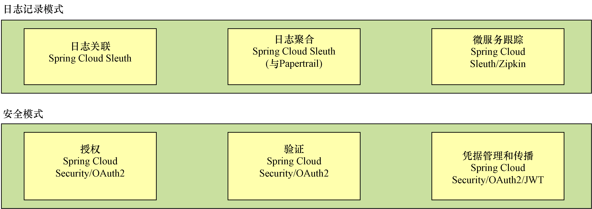

### 为什么是云和微服务:

基于云的微服务的优势是以弹性的概念为中心。云服务供应商允许开发人员在几分钟内快速启动新的虚拟机和容器。如果服务容量需求下降，开发人员可以关闭虚拟服务器，而不会产生任何额外的费用。使用云供应商部署微服务可以显著地提高应用程序的水平可伸缩性（添加更多的服务器和服务实例）。

单体应用缺点：
1. 牵一发而动全身。改一行代码需重启整个应用（对开发、运维、部署都不利）。
2. 扩展性不强。不能通过对单一服务进行扩展，只能拷贝整个应用来实现集群。

技术点：
1. 注册中心：服务实例启动时向中心注册自己，其他服务通过中心查询到它。
2. 负载均衡：一个服务启动多个实例来应对服务器负载均衡（nginx）和客户端负载均衡（Ribbon）。
3. 服务网关：请求过滤、url解析定位服务。
4. 配置中心：
5. Message Queue：各服务之间消息通讯的消息总线和消息驱动机制。

各模式的实现项目：




## Spring Cloud Config

配置中心关键注解：`@EnableConfigServer`

```xml
<dependency>
  <groupId>org.springframework.cloud</groupId>
  <artifactId>spring-cloud-starter-config</artifactId>
</depenency>
<dependency>
<groupId>org.springframework.cloud</groupId>
<artifactId>spring-cloud-config-server</artifactId>
</dependency>
```


```yaml
server:
  port: 8888
spring:
  profiles:
    active: native # 以native profile运行
  cloud:
    config:
      server:
        # 文件系统
        native:
        searchLocations: file:///Users/jobs/confsvr/src/main/resources/config/licensingservice
        # Git
        git:
        url: https://github.com/carnellj/config-repo/
        searchPaths: licensingservice,organizationservice
        username: 
        password: 
```

发起`GET`请求可获取信息：

http://localhost:8888/licensingservice/default

http://localhost:8888/licensingservice/dev

### Spring Boot客户端集成

```xml
<dependency>
  <groupId>org.springframework.cloud</groupId>
  <artifactId>spring-cloud-config-client</artifactId>
</dependency>
```

```yaml
spring:
  application:
    # 指定服务的名称，以便知道查找哪个服务，Spring Cloud Config上有一个与之对应的目录
    name: licensingservice
  # profile是区分使用哪个配置数据的机制，如没配置将使用默认profile
  profiles:
    active:
      default
  cloud:
    config:
      uri: http://localhost:8888
```

`RefreshScope`注解能够使用`/refresh`端点重新读取配置

## 服务发现

查看注册表内容：

http://localhost:8761/eureka/apps/organizationservices

```xml
<dependency>
  <groupId>org.springframework.cloud</groupId>
  <artifactId>spring-cloud-starter-eureka-server</artifactId>
</dependency>
```

```yaml
server:
  port: 8761
eureka:
  client:
    registerWithEureka: false # 不要使用Eureka服务进行注册（本身就是）
  fetchRegistry: false # 不要在本地缓存注册表信息
  server:
    waitTimeInMsWhenSyncEmpty: 5 # 在服务器接收请求之前等待的初始时间
```

启动`Eureka`服务注解：`@EnableEurekaServer`

### 注册服务

```xml
<dependency>
  <groupId>org.springframework.cloud</groupId>
  <artifactId>spring-cloud-starter-eureka</artifactId>
</dependency>
```

```yaml
spring:
  application:
    name: organizationservice # 将使用Eureka注册的服务的逻辑名称
  profiles:
    active:
      default
  cloud:
    config:
      enabled: true
eureka:
  instance:
    preferIpAddress: true # 注册服务的IP，而不是服务器名称
  client:
    registerWithEureka: true
    fetchRegistry: true # 本地缓存注册表，而不是每次都调用Eureka服务
    serviceUrl:
      defaultZone: http://localhost:8761/eureka/
```

### 查找服务

#### Spring DiscoveryClient

```java
@EnableDiscoveryClient
public class Application {}
```

```java
public Organization getOrganization(String organizationId) {
  RestTemplate restTemplate = new RestTemplate();
  // 传入要查找的服务的关键字，以检索ServiceInstance对象的列表
  List<ServiceInstance> instances = discoveryClient.getInstances("organizationservice");
  if (instances.size() == 0) return null;
  // 使用列表中的第一个ServiceInstance
  String serviceUri = String.format("%s/v1/organizations/%s", instances.get(0).getUri().toString(), organizationId);
  ResponseEntity<Organization> restExchange = restTemplate.exchange(
    serviceUri,
    HttpMethod.GET,
    null, Organization.class, organizationId);
    return restExchange.getBody();
}
```

+ 没有利用`Ribbon`的客户端负载均衡
+ 开发人员做了太多的工作，必须构建一个用来调用服务的`URL`

#### 启动RestTemplate的Spring DiscoveryClient

无需`@EnableDiscoveryClient`

```java
// 创建一个支持Ribbon的RestTemplate类
@LoadBalanced
@Bean
public RestTemplate getRestTemplate() {
  return new RestTemplate();
}
```

```java
@Autowired
RestTemplate restTemplate;

public Organization getOrganization(String organizationId) {
ResponseEntity<Organization> restExchange = restTemplate.exchange(
  "http://organizationservice/v1/organizations/{organizationId}",
  HttpMethod.GET,
  null, Organization.class, organizationId);
  return restExchange.getBody();
}
```

通过使用 RestTemplate 类，Ribbon 将在所有服务实例之间轮询负载均衡所有请求。

#### Netflix Feign客户端

```java
@EnableFeignClients
public class Application {}
```

```java
@FeignClient("organizationservice")
public interface OrganizationFeignClient {

  @RequestMapping(
    method= RequestMethod.GET,
    value="/v1/organizations/{organizationId}",
    consumes="application/json")
  Organization getOrganization(@PathVariable("organizationId") String organizationId);

}
```

## 客户端弹性模式

```xml
<dependency>
  <groupId>org.springframework.cloud</groupId>
  <artifactId>spring-cloud-starter-hystrix</artifactId>
</dependency>
```

```java
@EnableCircuitBreaker
public class Application {}
```

### 断路器

当`Spring`框架看到`@HystrixCommand`时，它将动态生成一个代理，该代理将包装该方法，并通过专门用于处理远程调用的线程池来管理对该方法的所有调用。


```java
@HystrixCommand
public List<License> getLicensesByOrg(String organizationId) {
  return licenseRepository.findByOrganizationId(organizationId);
}

@HystrixCommand(
  commandProperties = {
    // 超时调用之前等待的时间
    @HystrixProperty(name="execution.isolation.thread.timeoutInMilliseconds", value="12000")})
public List<License> getLicensesByOrg(String organizationId) {
  return licenseRepository.findByOrganizationId(organizationId);
}
```

### 后备处理

```java
// 如果来自Hystrix的调用失败，就会调用fallbackMethod
@HystrixCommand(fallbackMethod = "buildFallbackLicenseList")
public List<License> getLicensesByOrg(String organizationId) {
  return licenseRepository.findByOrganizationId(organizationId);
}

// 必须与由@HystrixCommand保护的原始方法位于同一个类中，并且必须具有与原始方法完全相同的方法签名
public List<License> buildFallbackLicenseList(String organizationId) {}
```

### 舱壁模式

```java
@HystrixCommand(
  threadPoolKey = "licenseByOrgThreadPool", // 定义线程池唯一名称
  threadPoolProperties = {
    @HystrixProperty(name = "coreSize", value="30"),
    @HystrixProperty(name = "maxQueueSize", value="10")}
)
public List<License> getLicensesByOrg(String organizationId) {
  return licenseRepository.findByOrganizationId(organizationId);
}
```

## 服务路由

```xml
<dependency>
  <groupId>org.springframework.cloud</groupId>
  <artifactId>spring-cloud-starter-zuul</artifactId>
</dependency>
```

```java
@EnableZuulProxy
public class ZuulServerApplication {}
```

如果没有指定任何路由，`Zuul`将自动使用正在调用的服务的`Eureka`服务`ID`，并将其映射到下游服务实例。

http://localhost:5555/organizationservice/v1/organizations/e254f8c-c442-4ebe-a82a-e2fc1d1ff78a

可以通过`Zuul`服务器上的`/routes`端点来访问路由

http://localhost:5555/routes

### 映射路由

```yaml
zuul:
  # 从Zuul完成的自动映射中排除Eureka服务ID organizationservice
  ignored-services: 'organizationservice'
  # 排除所有基于Eureka服务ID的路由的注册
  ignored-services: '*'
  # 所有已定义的服务都将添加前缀/api
  prefix: /api
  routes:
    # 手动映射路由
    organizationservice: /organization/**
    # 静态路由，直接调用，不通过Eureka
    licensestatic:
      path: /licensestatic/**
      url: http://licenseservice-static:8081
```

在默认情况下，对于任何需要用超过1s的时间（这是Hystrix默认值）来处理请求的调用，Zuul将终止并返回一个`HTTP 500`错误。可以通过在`Zuul`服务器的配置中设置`Hystrix`超时属性来配置此行为。

`hystrix.command.default.execution.isolation.thread.timeoutInMilliseconds: 2500`

`hystrix.command.licensingservice.execution.isolation.thread.timeoutInMilliseconds: 3000`

> 对于超过5s的配置，必须同时设置`Hystrix`和`Ribbon`超时。


