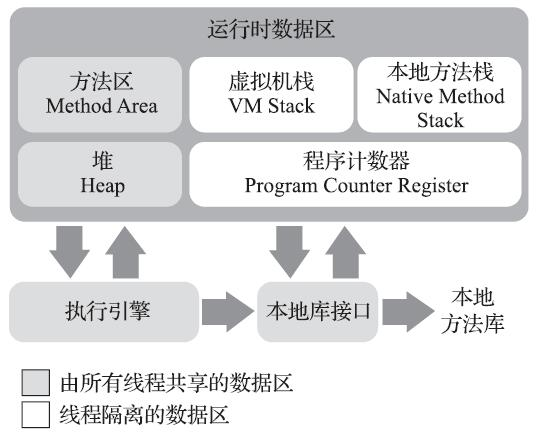

# 深入理解Java虚拟机

## Java内存区域

## 垃圾收集器与内存分配策略

### 对象存活算法

引用计数算法：给对象中添加一个引用计数器，每当有一个地方引用它时，计数器值就加1；当引用失效时，计数器值就减1；任何时刻计数器为0的对象就是不可能再被使用的。（很难解决对象之间相互循环引用的问题。）

可达性分析算法：通过一系列的称为"GCRoots"的对象作为起始点，从这些节点开始向下搜索，搜索所走过的路径称为引用链（ReferenceChain），当一个对象到GCRoots没有任何引用链相连时，则证明此对象是不可用的。

GC Roots对象：

+ 虚拟机栈（栈帧中的本地变量表）中引用的对象。
+ 方法区中类静态属性引用的对象。
+ 方法区中常量引用的对象。
+ 本地方法栈中JNI（即一般说的Native方法）引用的对象。

引用：

+ 强引用Strong Reference: 类似`Object obj = newObject()`这类的引用，gc永远不会回收。
+ 软引用Soft Reference: 还有用但并非必需的对象。对于软引用关联着的对象，在系统将要发生内存溢出异常之前，将会把这些对象列进回收范围之中进行第二次回收。如果这次回收还没有足够的内存，才会抛出内存溢出异常。
+ 弱引用Weak Reference: 非必需对象，强度比软引用更弱，只能生存到下次gc发生之前。
+ 虚引用Phantom Reference: 也称为幽灵引用或者幻影引用。对象是否有虚引用的存在，完全不会对其生存时间构成影响，也无法通过虚引用来取得对象实例。为对象设置虚引用关联的唯一目的就是能在这个对象被gc时收到一个系统通知。

永久代的垃圾收集主要回收两部分内容：废弃常量和无用的类。

### 垃圾收集算法

标记-清除算法（Mark-Sweep）

不足：效率问题，标记和清除两个过程的效率都不高。空间问题，标记清除之后会产生大量不连续的内存碎片。需要分配较大对象时，无法找到足够的连续内存而不得不提前触发另一次gc。

复制算法

不足：这种算法的代价是将内存缩小为了原来的一半，

现在的商业虚拟机都采用这种收集算法来回收新生代，将内存分为一块较大的Eden空间和两块较小的Survivor空间，每次使用Eden和其中一块Survivor。回收时将Eden和Survivor中存活对象一次性复制到另外一块Survivor空间上，最后清理掉Eden和刚才用过的Survivor空间。HotSpot虚拟机默认Eden和Survivor的大小比例是8:1。

当Survivor空间不够用时，依赖老年代进行分配担保（HandlePromotion）。

标记-整理算法

复制算法在对象存活率较高时就要进行较多的复制操作，效率将会变低。而且需要分配担保。

标记过程仍然与“标记-清除”算法一样，但后续步骤不是直接对可回收对象进行清理，而是让所有存活的对象都向一端移动，然后直接清理掉端边界以外的内存。

### HotSpot的算法实现

枚举根节点

可达性分析算法中，逐个检查GC Roots节点的引用，会消耗很多时间。而且分析工作必须在一个能确保一致性的快照中进行。是“Stop The World”的一个重要原因。

HotSpot使用一组称为`OopMap`的数据结构来达到准确式GC。在类加载完成的时候，HotSpot就把对象内什么偏移量上是什么类型的数据计算出来，在JIT编译过程中，也会在特定的位置记录下栈和寄存器中哪些位置是引用。

安全点

如果为每一条指令都生成对应的`OopMap`，那将会需要大量的额外空间，这样GC的空间成本将会变得很高。HotSpot只在安全点（Safepoint）记录这些信息。安全点的选定基本上是以程序“是否具有让程序长时间执行的特征”为标准。（例如方法调用、循环跳转、异常跳转）

主动式中断的思想是当GC需要中断线程的时候，不直接对线程操作，仅仅简单地设置一个标志，各个线程执行时主动去轮询这个标志，发现中断标志为真时就自己中断挂起。

安全区域

对于程序“不执行”的时候（`Sleep`或`Blocked`状态），线程无法响应JVM的中断请求，需要安全区域（Safe Region）来解决。

安全区域是指在一段代码片段之中，引用关系不会发生变化。在这个区域中的任意地方开始GC都是安全的。可以看做是被扩展了的Safepoint。在线程执行到SafeRegion中的代码时，首先标识自己已经进入了SafeRegion，当在这段时间里JVM要发起GC时，就不用管标识自己为SafeRegion状态的线程。在线程要离开SafeRegion时，系统是否已经完成了GC，如果完成了，那线程就继续执行，否则就等待收到可以安全离开SafeRegion的信号为止。

### 垃圾收集器

#### Serial收集器

#### ParNew收集器

Serial收集器的多线程版本

#### Parallel Scavenge收集器

目标是达到一个可控制的吞吐量（Throughput）：CPU用于运行用户代码的时间与CPU总消耗时间的比值，即吞吐量=运行用户代码时间/（运行用户代码时间+垃圾收集时间），虚拟机总共运行了100分钟，其中垃圾收集花掉1分钟，那吞吐量就是99%。

停顿时间越短就越适合需要与用户交互的程序，良好的响应速度能提升用户体验，而高吞吐量则可以高效率地利用CPU时间，尽快完成程序的运算任务，主要适合在后台运算而不需要太多交互的任务。

`MaxGCPauseMillis`参数允许的值是一个大于0的毫秒数，收集器将尽可能地保证内存回收花费的时间不超过设定值。GC停顿时间缩短是以牺牲吞吐量、减少新生代空间来换取的，导致垃圾收集发生更频繁。

#### Serial Old收集器

用途是在JDK1.5以及之前的版本中与Parallel Scavenge收集器搭配使用，另一种用途就是作为CMS收集器的后备预案，在并发收集发生Concurrent Mode Failure时使用。

Parallel Scavenge收集器架构中本身有PS MarkSweep收集器来进行老年代收集，并非直接使用了Serial Old收集器（所以日志里的老年代显示为PSOldGen，而非Serial Old的tenured），但是这个PS MarkSweep收集器与Serial Old的实现非常接近。

#### Parallel Old收集器

#### CMS收集器

CMS（Concurrent Mark Sweep）收集器是一种以获取最短回收停顿时间为目标的收集器。目前很大一部分的Java应用集中在互联网站或者B/S系统的服务端上，这类应用尤其重视服务的响应速度，希望系统停顿时间最短，以给用户带来较好的体验。CMS收集器就非常符合这类应用的需求。

基于“标记-清除”算法实现，过程分为4个步骤：

+ 初始标记（CMS initial mark）
    "Stop The World"，仅仅只是标记一下GC Roots能直接关联到的对象，速度很快
+ 并发标记（CMS concurrent mark）
    进行GC RootsTracing的过程
+ 重新标记（CMS remark）
    "Stop The World"，修正并发标记期间因用户程序继续运作而导致标记产生变动的那一部分对象的标记记录，这个阶段的停顿时间一般会比初始标记阶段稍长一些，但远比并发标记的时间短。
+ 并发清除（CMS concurrent sweep）

CMS收集器无法处理浮动垃圾（Floating Garbage），可能出现"Concurrent Mode Failure"失败而导致另一次Full GC的产生。由于CMS并发清理阶段用户线程还在运行着，伴随程序运行自然就还会有新的垃圾不断产生，这一部分垃圾出现在标记过程之后，CMS无法在当次收集中处理掉它们，只好留待下一次GC时再清理掉。这一部分垃圾就称为“浮动垃圾”。也是由于在垃圾收集阶段用户线程还需要运行，那也就还需要预留有足够的内存空间给用户线程使用，因此CMS收集器不能像其他收集器那样等到老年代几乎完全被填满了再进行收集，需要预留一部分空间提供并发收集时的程序运作使用。

出现"Concurrent Mode Failure"失败，虚拟机将启动后备预案：临时启用Serial Old收集器来重新进行老年代的垃圾收集。

基于“标记-清除”算法，空间碎片过多时会给大对象分配带来麻烦，当无法找到足够大的连续空间来分配对象，不得不提前触发一次Full GC。默认情况下在要进行Full GC时开启内存碎片整理。整理过程由于无法并发而导致停顿时间变长。

GC日志中的别名

算法|别名
-|-
Serial|DefNew
ParNew|ParNew
Parallel Scavenge|PSYoungGen
Serial Old|tenured
Parallel Scavenge版本自带Serial Old|PSOldGen
Parallel Old|ParOldGen

HotSpot将根据计算机的配置和JVM的类型自动选择收集器，可以自己指定，JDK 8跟之前的版本配置不同：

JDK 8组合|参数|-
-|-|-
Parallel + Parallel Old|`-XX:+UseParallelGC` or `-XX:+UseParallelOldGC`|设置其中一个会自动设置另外一个
ParNew + CMS|`-XX:+UseConcMarkSweepGC`|会自动设置`-XX:+UseParNewGC`
G1|`-XX:+UseG1GC`
Parallel + Serial Old|`-XX:+UseParallelGC -XX:-UseParallelOldGC`|明确指明不使用Parallel Old
Serial + Serial Old| `-XX:+UseSerialGC`

JDK 8弃用的组合（不建议）|参数
-|-
Serial + CMS|`-XX:+UseConcMarkSweepGC -XX:-UseParNewGC`
ParNew + Serial Old|`-XX:+UseParNewGC`

